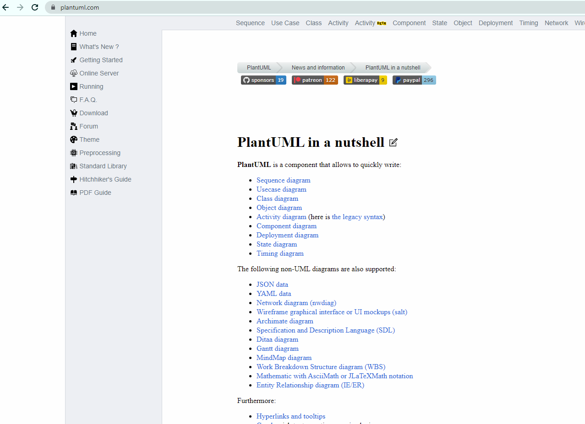
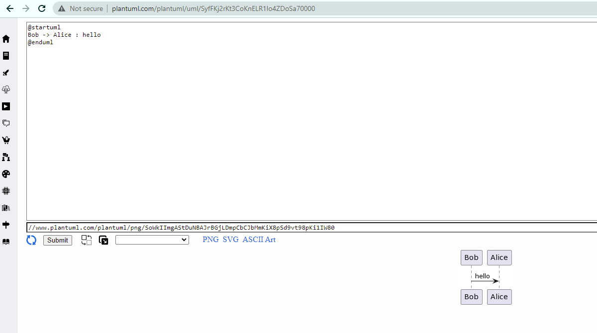
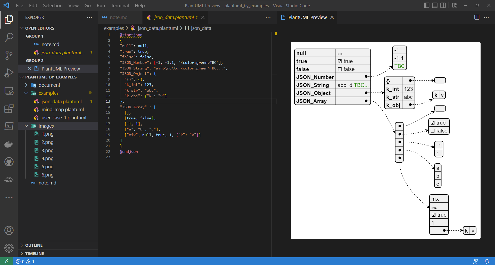
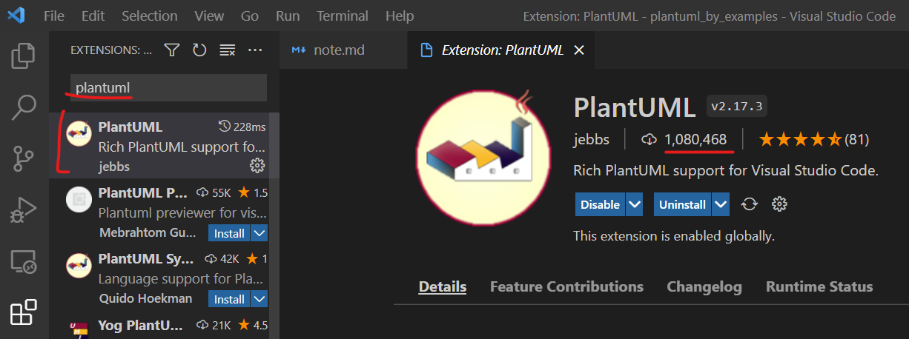
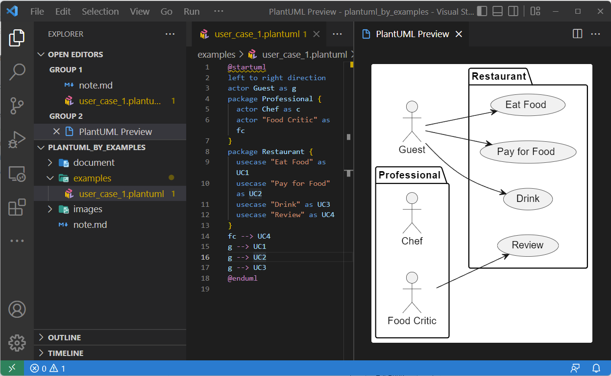
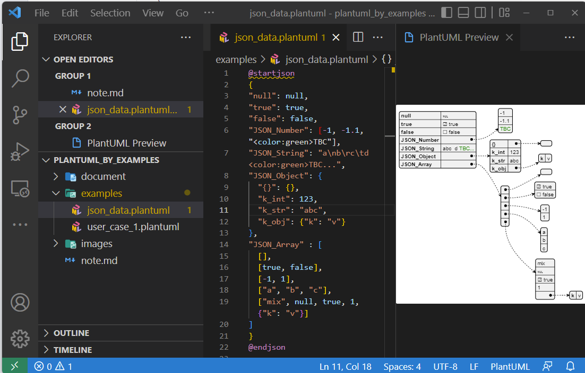
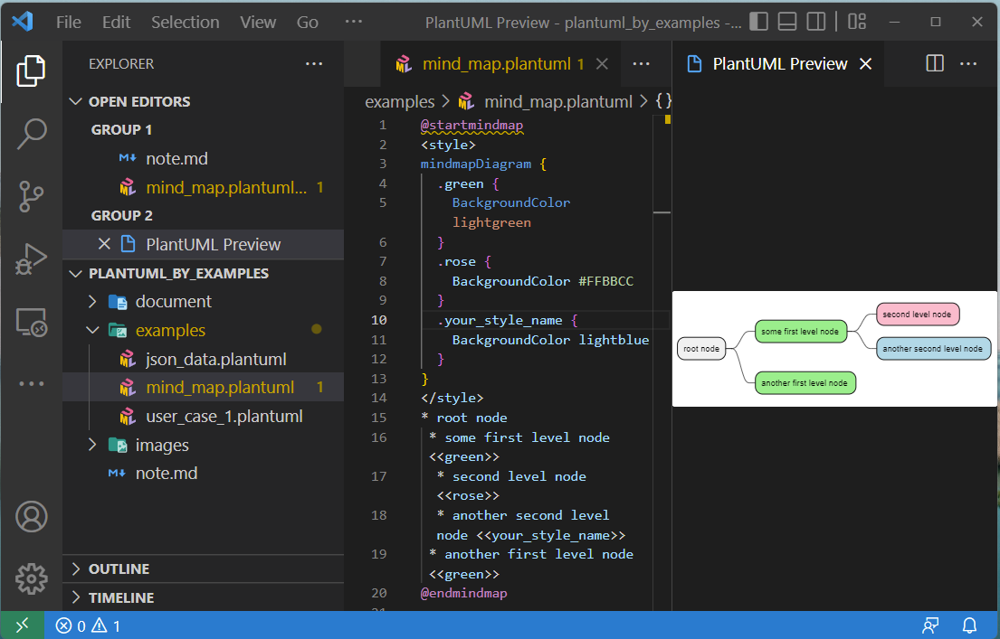

# How to use PlantUML to draw your diagram or flow effectively.

## 1. Introduction.

If you are in the following cases, **PlantUML will be the hero to rescue you.**
- You have to face the change request from the client regularly, each time you have to update the flow or the diagram to your design.
- You want to keep track of all the changes to the flow/ digram by using a source version control such as git, and SVN.
- You want a tool to help you to update quickly your diagram and you don't have to pay a considerable time to create another instance of it.

## 2. Installing and Setup PlantUML.

### 2.1. Using PlantUML online.

If you want to use it quickly, without any installation, just need a browser. You should visit https://plantuml.com/ to explore and try it.

This is an official site, it includes
- The official document relates to the syntax of plantUML and a bunch of awesome things.
- The online editor will help you to create the diagram, export the diagram, and share the diagram by a link or a file.

You can navigate the online editor of PlantUML by the following link:

http://www.plantuml.com/plantuml/uml/SyfFKj2rKt3CoKnELR1Io4ZDoSa70000

### 2.2. Using PlantUML in Visual Studio Code.

**Step 1:** You have to need to install the java runtime to your local machine to run PlantUml.

https://www.java.com/en/download/

**Step 2:** In your Visual Studio Code, navigate to the extension and search 'plantuml` and install it by the image below.

After installation, you can read the introduction of this extension to learn how to use it.

## 3. How to use the PlantUML syntax effectively.

To see all the syntax and the diagram types, please go to the official site of PlantUML.

### 3.1 User Case

In VS Code, type the syntax in which you want to create the diagram, the hit `Alt + D` to see the generated image.

### 3.2 Json Data

### 3.2 Mindmap

## 4. References

[VS Code PlantUML Read me in github](https://github.com/qjebbs/vscode-plantuml#requirements)

[PlantUML Offical site](https://plantuml.com/)
